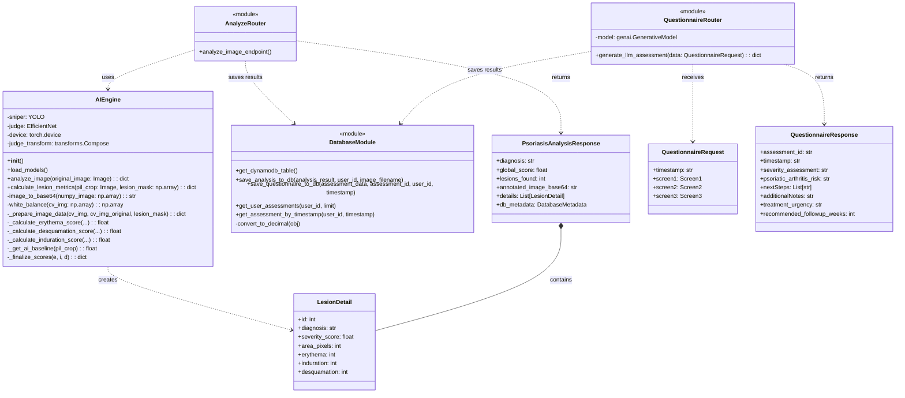

# PsoMetric Backend - Class Diagram

## Overview
This document illustrates the class structure and relationships within the PsoMetric Backend system. The system is built using FastAPI and follows a modular architecture separating services, schemas, database interactions, and API routers.

## System Class Diagram

    ## Component Descriptions

    ### 1. AIEngine (Service Layer)
    The `AIEngine` is a singleton class responsible for the core computer vision and deep learning tasks.
    - **Responsibilities**:
        - Loading and managing AI models (YOLO "Sniper" and EfficientNet "Judge").
        - Preprocessing images (white balancing, cropping).
        - Calculating PASI metrics (Erythema, Induration, Desquamation).
        - Aggregating scores into a global severity diagnosis.

    ### 2. Database Module (Data Layer)
    A functional module handling all interactions with AWS DynamoDB.
    - **Responsibilities**:
        - Managing database connections.
        - Converting Python types to DynamoDB Decimal types.
        - Saving image analysis results.
        - Saving questionnaire assessments.
        - Retrieving user history.

    ### 3. API Routers (Controller Layer)
    - **AnalyzeRouter**: Handles image upload requests, invokes the `AIEngine`, and returns analysis results.
    - **QuestionnaireRouter**: Handles questionnaire submissions, invokes Google Gemini LLM for text analysis, and returns recommendations.

    ### 4. Schemas (Model Layer)
    Pydantic models that define the structure of API requests and responses, ensuring type safety and automatic validation.
